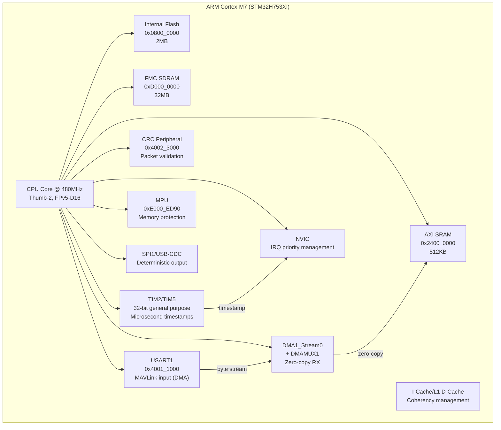
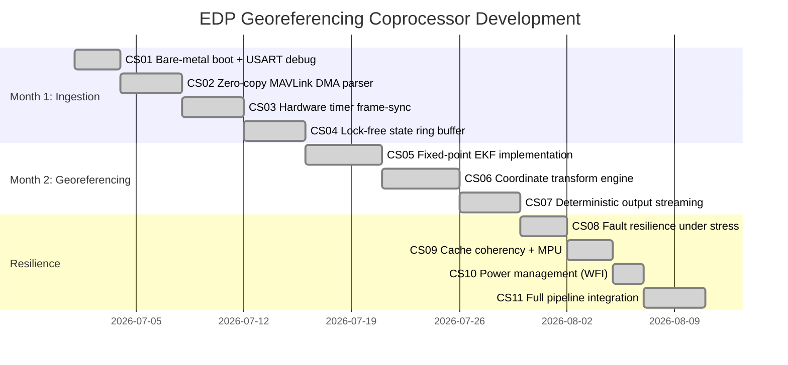

# Architecture

This is a deterministic radar-inertial georeferencing coprocessor targeting the ARM Cortex-M7 (STM32H753XI). It sits between the drone's flight controller and the radar SoC's digital backend, solving the spatial drift problem that makes raw radar detections useless for rescue mapping.

## System Context

```mermaid
flowchart LR
    subgraph Drone["Drone Platform"]
        FC["Pixhawk Flight Controller<br/>(PX4/ArduPilot)<br/>MAVLink @ 100+ Hz"]
        Radar["Radar SoC<br/>Frame-sync signal<br/>Range-Doppler target lists"]
    end

    subgraph Coprocessor["STM32H753XI Coprocessor"]
        MAVPARSE["Zero-Copy<br/>MAVLink Parser<br/>(DMA circular buffer)"]
        TIMSYNC["Hardware Timer<br/>Sync<br/>(Microsecond timestamps)"]
        RINGBUF["Lock-Free<br/>State Buffer<br/>(Kinematic history)"]
        EKF["Fixed-Point EKF<br/>(CMSIS-DSP matrices)"]
        GEO["Coordinate<br/>Transform<br/>(Polar→ENU→Lat/Long)"]
        OUT["Deterministic<br/>Output<br/>(SPI/USB-CDC)"]
    end

    subgraph Ground["Ground Station"]
        LAPTOP["Laptop UI<br/>Georeferenced overlay"]
    end

    FC -->|"UART1 (MAVLink)"| MAVPARSE
    Radar -->|"Frame-sync IRQ"| TIMSYNC
    TIMSYNC -->|"Timestamped frame"| RINGBUF
    MAVPARSE -->|"Attitude + Position"| RINGBUF
    RINGBUF -->|"State window"| EKF
    EKF -->|"Fused state"| GEO
    GEO -->|"Georeferenced targets"| OUT
    OUT -->|"Binary metadata stream"| LAPTOP

    style FC fill:#e3f2fd
    style Radar fill:#e3f2fd
    style Coprocessor fill:#f3e5f5
    style LAPTOP fill:#e8f5e7
```



## Firmware Pipeline



## Memory Map

| Region | Address | Size | Purpose |
|--------|---------|------|---------|
| Internal Flash | `0x0800_0000` | 2MB | Firmware code, vector table, constants |
| AXI SRAM | `0x2400_0000` | 512KB | Stack, `.data`, `.bss`, ring buffers, EKF state matrices |
| SDRAM (FMC) | `0xD000_0000` | 32MB | Large kinematic history buffer, radar frame window |

## Build Toolchain

```
arm-none-eabi-gcc -mcpu=cortex-m7 -mthumb -mfloat-abi=hard -mfpu=fpv5-d16
```

Linked with `--specs=nosys.specs` and `-nostdlib` to keep it truly bare-metal. The Renode simulation is driven by a `.rescript` monitor file that injects MAVLink packets and radar frame-sync signals, then runs the emulation for a fixed virtual time window.

## Pipeline Stages

| Stage | Peripheral | Function |
|-------|-----------|----------|
| 1. Boot | — | Vector table, Reset_Handler, USART debug |
| 2. MAVLink Ingestion | USART1 + DMA1 | Zero-copy DMA circular buffer for attitude packets |
| 3. Hardware Timestamp | TIM2/TIM5 + NVIC | Microsecond-precise frame-sync capture |
| 4. State Buffer | AXI SRAM | Lock-free ring buffer for kinematic history |
| 5. EKF Fusion | CMSIS-DSP | Fixed-point matrix operations for state estimation |
| 6. Coordinate Transform | FPU (FPv5-D16) | Polar→ENU→Lat/Long with velocity compensation |
| 7. Output | SPI1/USB-CDC | Binary georeferenced target frames to ground |

## Milestone Evolution


