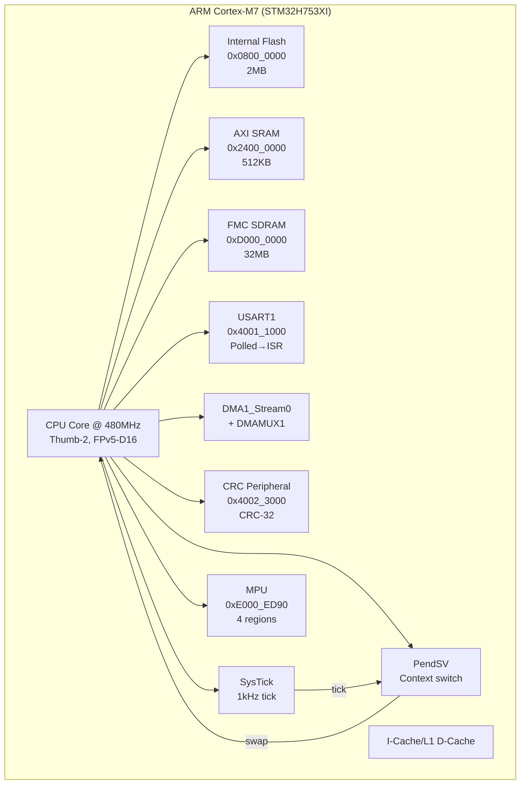
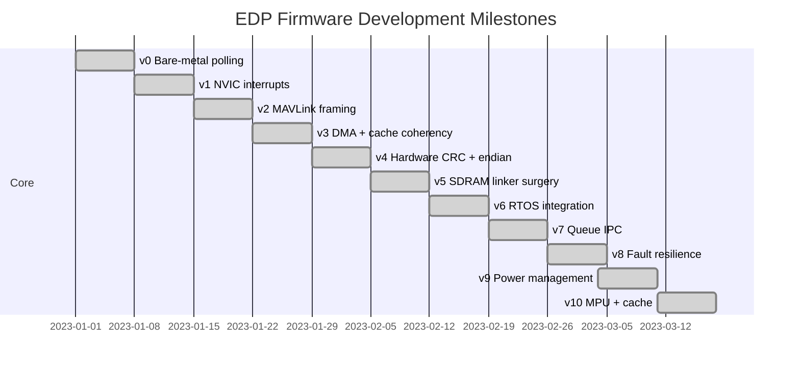

# Architecture

This is a bare-metal firmware project targeting the ARM Cortex-M7 (STM32H753XI). No RTOS, no HAL, no standard library — just the CPU, the peripherals, and a lot of `volatile` pointer casts.

## Firmware Stack



## Memory Map

| Region | Address | Size | Purpose |
|--------|---------|------|---------|
| Internal Flash | `0x0800_0000` | 2MB | Firmware code |
| AXI SRAM | `0x2400_0000` | 512KB | Stack, `.data`, `.bss`, ring buffers |
| SDRAM (FMC) | `0xD000_0000` | 32MB | Large telemetry circular buffer (v5+) |

## Build Toolchain

```
arm-none-eabi-gcc -mcpu=cortex-m7 -mthumb -mfloat-abi=hard -mfpu=fpv5-d16
```

Linked with `--specs=nosys.specs` and `-nostdlib` to keep it truly bare-metal. The Renode simulation is driven by a `.rescript` monitor file that injects test characters and runs the emulation for a fixed virtual time window.

## Milestone Evolution


