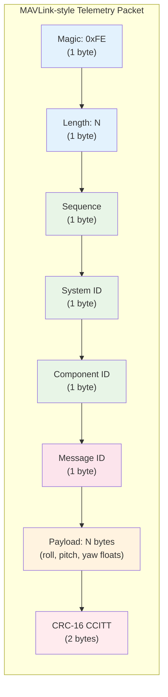
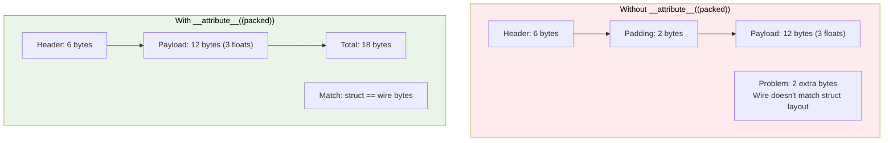
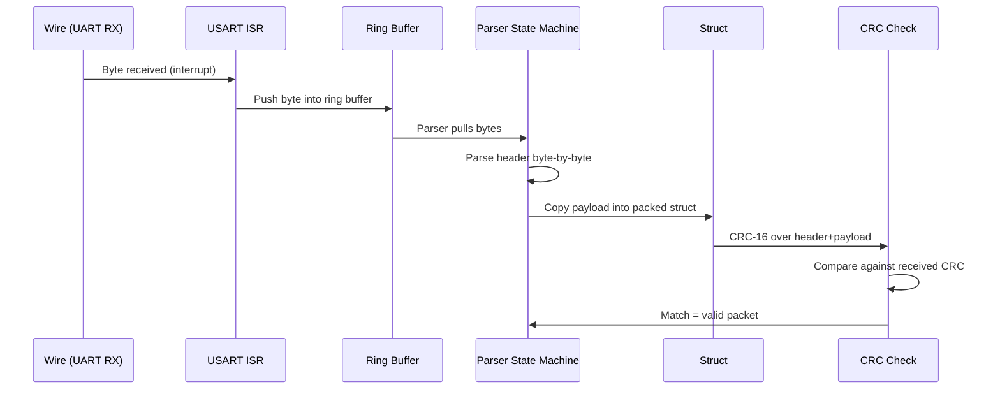

# Protocol

The telemetry protocol is a simplified MAVLink v1/v2-inspired binary packet format. Nothing too fancy — just enough to exercise the parser and stress-test the edge cases.

## Packet Structure

## Key Design Decisions

### Struct Packing

The ARM Cortex-M7 is 32-bit and GCC naturally aligns `float` fields to 4-byte boundaries. Our 6-byte header means the compiler injects 2 bytes of invisible padding before the first `float`. We fixed this with `__attribute__((packed))` in v2.

### Data Flow

### Endianness Collision (v4)

The Cortex-M7 is little-endian, but the hardware CRC peripheral processes words MSB-first. Without `REV_IN`, a 32-bit write of `0x34333231` feeds the wrong byte order into the CRC engine, producing wrong checksums. The fix was enabling `USART_CR1_RE` ... no, actually enabling `CRC_CR_REV_IN` in the CRC peripheral config register.
