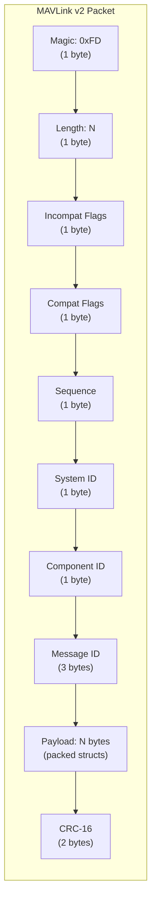
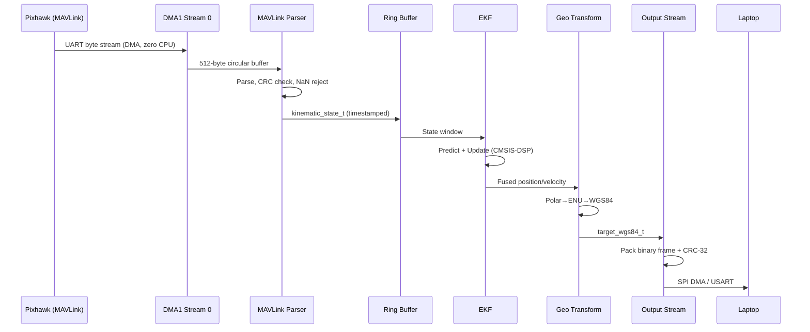
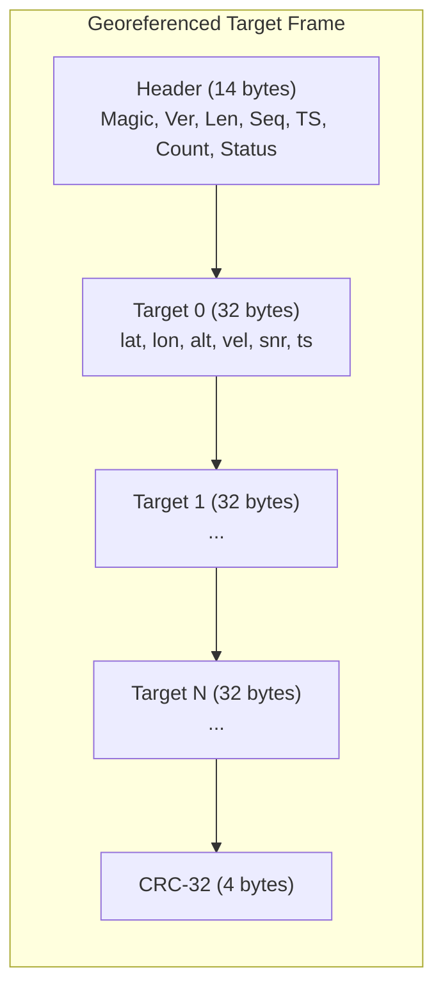

# Protocol

## MAVLink Input (from Pixhawk)

The coprocessor ingests three MAVLink v2 message types from the flight controller:

| Message | ID | Rate | Purpose |
|---------|----|------|---------|
| `ATTITUDE` | 30 | 100 Hz | Roll, pitch, yaw + angular rates |
| `LOCAL_POSITION_NED` | 32 | 50 Hz | Position + velocity in NED frame |
| `GLOBAL_POSITION_INT` | 33 | 10 Hz | WGS84 lat/lon/alt for georeferencing |

### MAVLink v2 Packet Structure



### Data Flow Through Pipeline



## Binary Output Frame (to Ground Laptop)



### Output Header Structure

```c
typedef struct __attribute__((packed)) {
    uint8_t  magic;          // 0xED
    uint8_t  version;        // 0x01
    uint16_t length;         // Total frame length
    uint32_t sequence;       // Monotonic frame counter
    uint32_t timestamp_us;   // Frame creation time (us)
    uint8_t  target_count;   // Number of targets
    uint8_t  status;         // System status flags
} output_header_t;  // 14 bytes
```

### Per-Target Record

```c
typedef struct __attribute__((packed)) {
    double   latitude;       // WGS84 degrees
    double   longitude;      // WGS84 degrees
    float    altitude;       // meters above MSL
    float    vel_east;       // m/s
    float    vel_north;      // m/s
    float    vel_up;         // m/s
    float    snr;            // dB
    uint32_t timestamp_us;   // Detection timestamp
} output_target_record_t;  // 32 bytes
```

## Key Design Decisions

### Struct Packing
All structs use `__attribute__((packed))` to prevent GCC padding. The 6-byte MAVLink header followed by float fields would cause 2 bytes of invisible padding without it.

### CRC-32 for Output Integrity
The output frame uses CRC-32 (STM32 hardware peripheral) over the entire frame including header and all target records. The ground station validates the CRC before displaying targets.

### Timestamp Interpolation
Since MAVLink attitude (100 Hz) and radar frame-sync (50 Hz) are asynchronous, the EKF interpolates attitude to the exact radar timestamp using the ring buffer's kinematic history. This reduces attitude age from 10 ms to <1 ms.

### DMA for Zero-Copy
Both input (USART1 RX) and output (SPI TX) use DMA to minimize CPU involvement. The CPU only runs the EKF and coordinate transform — the data movement is entirely peripheral-driven.
