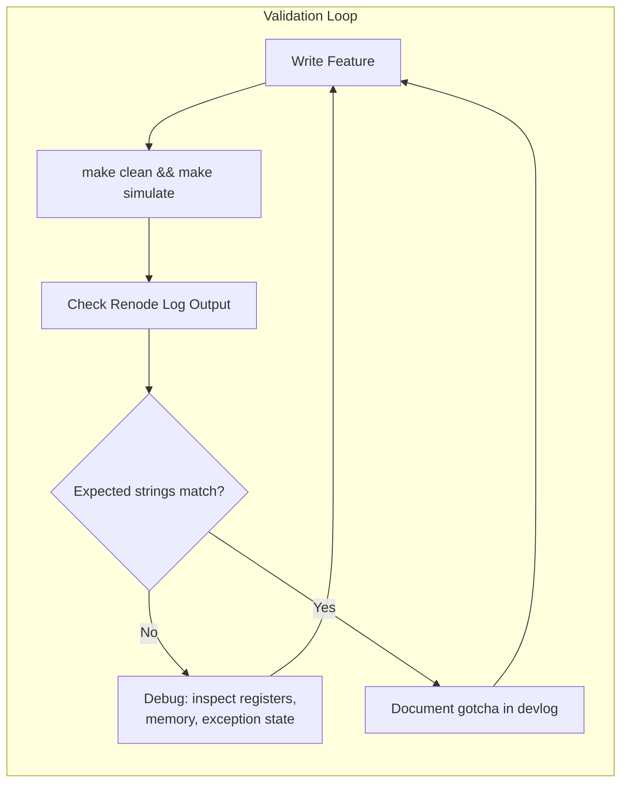
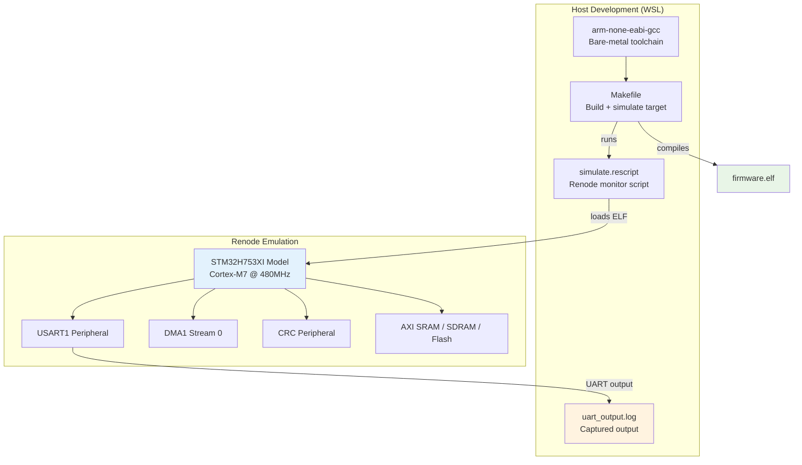
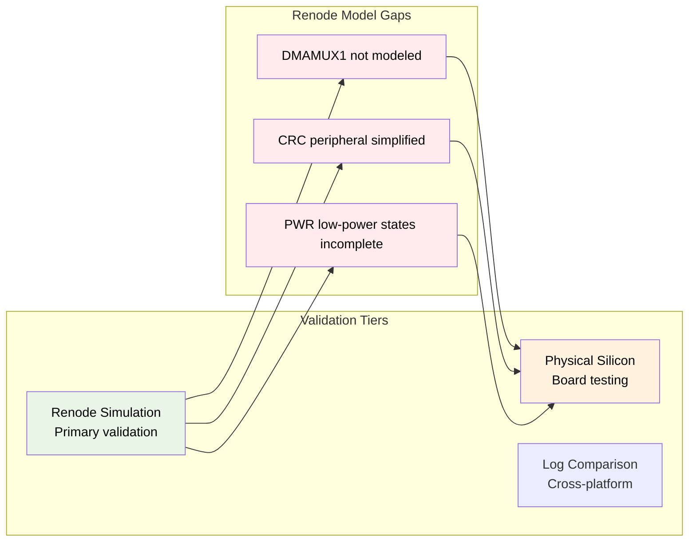

# Verification

Verification here means "run it in Renode and look at the log output." It's not formal, but it's honest.

## Why Renode

We picked Renode because it gives deterministic, shared virtual time simulation. If you need to debug a race condition between the DMA mutating memory and the CPU reading it, you can pause the entire system clock, inspect AXI_SRAM byte-by-byte, and resume. Try doing that with a logic analyzer on a physical NUCLEO board.

The catch: Renode's STM32H7 model isn't complete. The DMAMUX1 peripheral, the CRC hardware block, and some low-power PWR register behaviors are either missing or simplified.

## The Validation Loop

## Simulation Pipeline

## Cross-Validation Tiers

