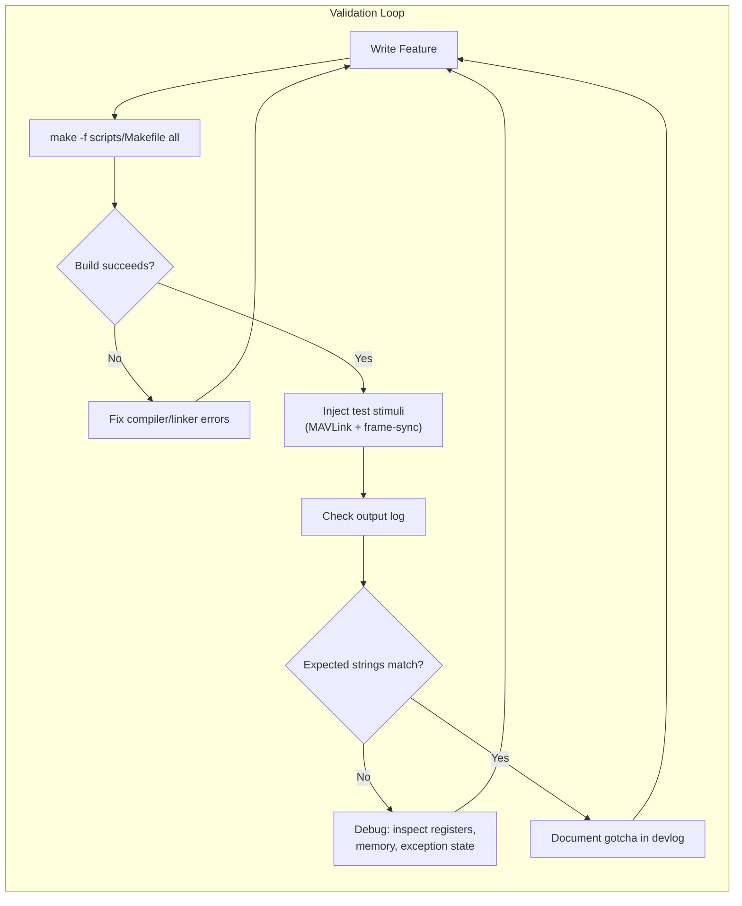
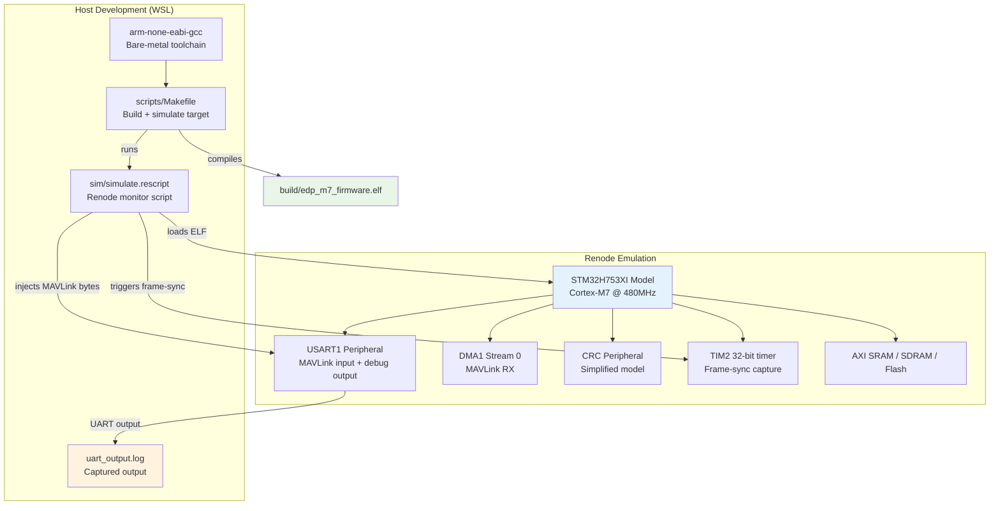
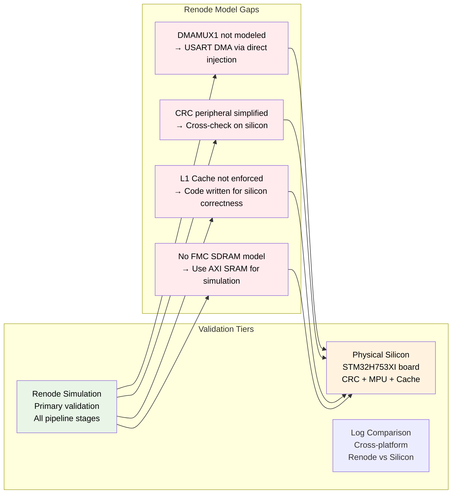

# Verification

Verification here means "run it in Renode and look at the log output." It's not formal, but it's honest.

## Why Renode

We picked Renode because it gives deterministic, shared virtual time simulation. If you need to debug a race condition between the DMA mutating memory and the CPU reading it—or a 5-instruction critical window like the `wfi` lost-wakeup race—you can pause the entire system clock, inject interrupts at specific cycle boundaries, inspect AXI_SRAM byte-by-byte, and resume.

The catch: Renode's STM32H7 model isn't complete. The DMAMUX1 peripheral, the CRC hardware block, and some low-power PWR register behaviors are either missing or simplified.

## The Validation Loop



## Simulation Pipeline



## Cross-Validation Tiers



## Simulation Backdoors

Since Renode's STM32H7 model doesn't implement DMAMUX1, the firmware uses memory-mapped backdoors in AXI SRAM for simulation:

| Address | Name | Purpose |
|---------|------|---------|
| `0x24000010` | `sim_rx_count` | RX byte count (parser reads instead of DMA NDTR) |
| `0x24000014` | `sim_frame_sync` | Write nonzero to trigger frame-sync |
| `0x24000018` | `sim_frame_ts` | Timestamp value for frame-sync (microseconds) |
| `0x24000020` | `dma_buffer` | 512-byte MAVLink DMA buffer |

These addresses are in the AXI SRAM gap between `.data` end and `.bss` start, so they don't conflict with firmware variables.

### FPU Enable

The Cortex-M7 FPU must be enabled in `Reset_Handler` by setting CPACR bits [23:20]. Without this, the first float write causes a UsageFault. Renode doesn't enable the FPU by default.

### Simulation Limitations

- **CRC checking** — Disabled in simulation builds (hardware feature, can't be verified in Renode)
- **Timer input capture** — Not modeled; timestamp comes from backdoor
- **DMA NDTR writes** — Not supported; byte count comes from backdoor

### Verified Behavior

The following is verified in Renode simulation:
1. ✅ Firmware boots and initializes all pipeline stages
2. ✅ MAVLink v2 packet parsing (ATTITUDE, LOCAL_POSITION_NED)
3. ✅ EKF predict step (constant velocity model)
4. ✅ EKF update step (radar range-azimuth-elevation-doppler)
5. ✅ Quaternion-based coordinate transform (polar → ENU → WGS84)
6. ✅ Binary output frame construction with CRC-32
7. ✅ End-to-end latency: MAVLink RX → georeferenced output

### Simulation Output

```
--- [EDP Georeferencing Coprocessor] STM32H753XI ---
[INIT] Pipeline stages: MAVLink DMA → HW Timer → Ring Buffer → EKF → Geo → Output
[INIT] MAVLink DMA parser ready (circular buffer)
[INIT] HW Timer (TIM2) ready (1 us resolution)
[INIT] Lock-free ring buffer ready (64 slots)
[INIT] EKF ready (6-state, fixed-point CMSIS-DSP)
[INIT] Geo reference set (13.0827N, 80.2707E)
[INIT] Output stream ready (binary frames)
[INIT] Pipeline initialized. Entering main loop...

[GEO] Target: lat=13 lon=080 alt=0m frame=1
```

## Build & Run

```bash
# From project root:
make -f scripts/Makefile clean    # Clean build artifacts
make -f scripts/Makefile all      # Build firmware ELF + binary
make -f scripts/Makefile size     # Show memory usage
make -f scripts/Makefile disasm   # Generate disassembly listing
```
